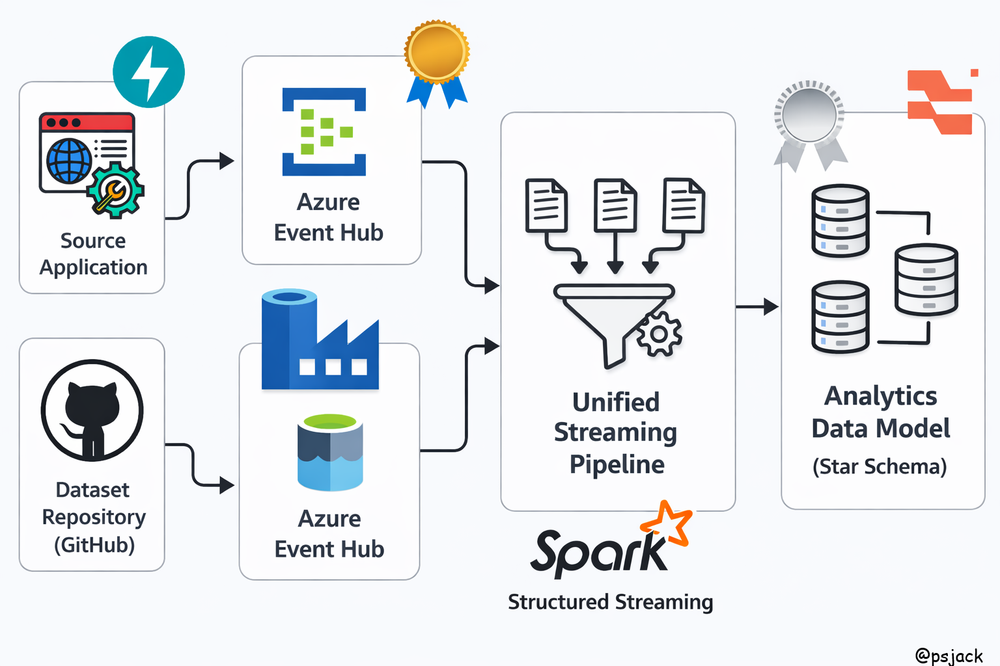

# Uber Streaming Data Pipeline

End-to-end **real-time and batch data engineering pipeline** for processing Uber ride events using **Apache Spark (Structured Streaming)** and **Azure-native services**, implementing a scalable **Medallion Architecture (Bronze, Silver, Gold)** for advanced analytics.

---

# Architecture

<p align="center">
  
</p>

---

# Project Overview

This project demonstrates a modern **real-time data engineering workflow** for processing ride booking events by combining **streaming ingestion and historical batch data** into a unified pipeline.

The pipeline performs:

- Real-time event ingestion from streaming sources  
- Historical data ingestion from data lake  
- Data cleaning and transformation  
- Data modeling using analytical schemas  
- Creation of business-ready, analytics datasets  

The implementation follows a **Medallion Architecture**, enabling progressive data refinement, improved data quality, and scalable processing for enterprise-grade analytics.

---

# Data Pipeline Layers

## Bronze Layer

Raw ingestion layer that captures both **real-time streaming events and historical batch data** with minimal transformation.

Responsibilities:

- Ingest streaming data from Event Hub  
- Store raw data in Data Lake  
- Preserve source fidelity for replay and debugging  
- Handle schema inference and evolution  

---

## Silver Layer

Data cleansing, enrichment, and transformation layer built using **Spark Structured Streaming**.

Responsibilities:

- Data validation and deduplication  
- Handling late-arriving and incomplete data  
- Data standardization and enrichment  
- Building structured, query-ready datasets  

---

## Gold Layer

Curated analytics layer designed for **high-performance querying and reporting**.

Responsibilities:

- Aggregation of business metrics  
- Implementation of **Star Schema (Fact & Dimension tables)**  
- Optimization for BI tools and dashboards  
- Serving analytics-ready datasets  

---

# Tech Stack

- **Azure Event Hub** – Real-time data ingestion  
- **Azure Data Lake Storage (ADLS)** – Scalable storage  
- **Apache Spark (PySpark / Structured Streaming)** – Processing engine  
- **Delta Lake** – ACID transactions and data reliability  
- **SQL** – Data modeling and transformations  
- **Python** – Pipeline development  
- **Git** – Version control and historical data tracking  

---

# Project Structure


```
uber-streaming-ingestion/

misc/
    arrays.json
    map_cities.json

notebooks/
    uber_bronze_adls.ipynb
    uber_silver_obt.ipynb

src/
    ingestion/
        ingest.py

    transformations/
        model.py
        silver.py
        silver_obt.sql

.gitignore
README.md
```


---

# Key Features

- Unified **streaming + batch data processing pipeline**  
- Implementation of **Medallion Architecture (Bronze → Silver → Gold)**  
- Real-time ingestion using Azure Event Hub  
- Scalable transformations using Spark Structured Streaming  
- Star Schema modeling for analytics  
- Modular and extensible pipeline design  

---

# Author

**Param Judge**
